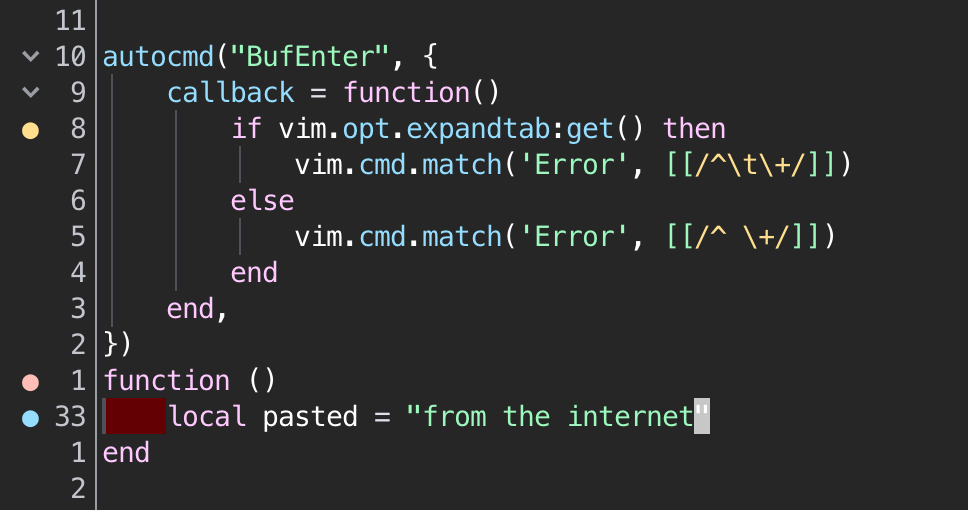

Ah, the never ending flamewar in programming: tabs or spaces. This post is not
about this discussion, but rather something both sides (should) find
frustrating: pasting code from the internet that uses another type of
indentation, which results in a code file with mixed types of indentation.

This problem can often by fixed by modern solutions. For example, using a LSP's
autoformatting (`vim.lsp.buf.format()`) is likely to correct the 'wrong'
indentation style of the pasted code.

Nevertheless, there are situations where this formatter does not fix this
particular issue, or when there is no formatter available. So I tried to find a
way to run [`:retab`](https://neovim.io/doc/user/change.html#%3Aretab) on the
pasted code using an autocommand of some sort. No luck, since Neovim only has
an `TextYankPost` event and no `TextPastePost`. I want to avoid running
`:retab` on the whole file, because it's a bit too aggressive and might ruin
other parts of your source file.

Thus, instead of automatically fixing the issue, the current solution is to
just highlight the 'wrong' indentation. It uses the value of
[`'expandtab'`](https://neovim.io/doc/user/options.html#'expandtab') to
determine if the file should use spaces or tabs as indentation.

I have wrapped the highlighting logic in an autocommand that fires on
`BufEnter`. It uses the `Error` highlight group, which in my case is a red
background and thus clear enough.

```
autocmd("BufEnter", {
	callback = function()
		if vim.opt.expandtab:get() then
			vim.cmd.match('Error', [[/^\t\+/]])
		else
			vim.cmd.match('Error', [[/^ \+/]])
		end
	end,
})
```

And here's a screenshot of how it looks:



It's not perfect, but it works for now. I might try to find a way to convert it
automagically when pasting in the future. If you have suggestions, [let me
know](/contact)!
